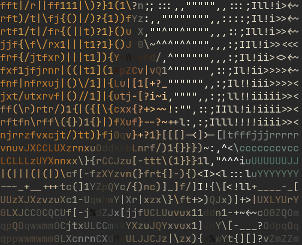

# ASCII Art Converter

A simple C program that converts images to ASCII art with optional color support.

## Example Output

### Original Image


### ASCII Art (Colored, scale: 8)


### ASCII ART (Plain Text, scale: 8)

```
fft|/r||ff111|\)?}1(1\?n;;:::,,""""",,:::;Ill!i><~
rft)/t|\fj{()|/)?{1))fYz:,,"""""""",,::::;Il!i>><~
rtf1/t|/fr{(||t)?1}()u*X,""^""^"""",,,::;Ill!i>><~
jjf{\f\/rx1|||t1?1}()Jo0\~^^^"^^""",,,:;IIl!i>><<<
frf{/jtfxr)|||t1]){Y*W*ahd/,^"""""",,,:;Il!ii><><~
fxf1jfjrnr|((|t1](1#pZCv|vQ1^"""""",::;Il!ii>>>><~
fnf|nfrxuj|()\/1]|{Lu|[1[+?_"""""",,:;Il!!iii>>>><
jxt/utxrvf|()//1]|{utj-[?i~i,"""",,:;;ll!!iiiii>><
ff(\r)rtr/)1{|({[\{cxx{?+>~~!:"",::;IIll!i!iiii>><
rftfn\rff\({})1{}|)fXuf}--?~++l:,:;Illl!!!!iiii>><
njrrzfvxcjt/)tt)}fj0qv}+?1}[[[]-<]>-[|tfffjjjrrrrr
vnuvJXCCLUXzrnxuOddkkbLnrf/)1{}}})~:,^<\cccccccvcc
LCLLLzUYXnnxx\}{rCCJzu[-ttt\(1}}}1l,"^^^iuUUUUUUJJ
|(|||(|(|)\cf[-fzXYzvn(}frt{]-){)<I><l:::luYYYYYYY
---_+__+++tc(]1YZpQYc/{)nc)]_]f/]I!{\[<!ll+____-_[
UUzXJXzvzuXc1-UqwhwY|Xr|xzx\}\ft+>)QJx)]+>|UXLYUrY
0LXJCCOCQCUf[-j%dZJx[jjfUCLUuvux11ddn1-+~<~cO0ZQOm
qpQOqwwmmOCjtxULCCmkkYXzuJQYxvux1]ahY\[-___?OdpqOq
qppwwmwmm0LXcnrnCXdMaULJJCJz|\zx){*%wYt{][]?vZmZZm
```

## Features

- Load images in various formats (JPEG, PNG, BMP, GIF, etc.) using `stb_image`
- Convert images to ASCII art using brightness-based character mapping
- Optional 24-bit true color output using ANSI escape codes
- Configurable downsampling for different output sizes
- Save ASCII art to text files
- Proper aspect ratio handling for terminal display

## Project Structure
```
c/
├── include/                # Header files
│   ├── ascii.h             # ASCII conversion functions
│   └── image.h             # Image structure and loading
├── src/                    # Source files
│   ├── ascii.c             # ASCII conversion implementation
│   ├── image.c             # Image loading and processing
│   └── main.c              # Main program entry point
├── lib/                    # External libraries
│   └── stb_image.h         # Single-header image loading library
├── examples/               # Example images for testing
│   ├── test_1.jpg
│   ├── test_2.jpg
│   └── test_3.jpg
├── output/                 # Sample outputs
│   └── example_output_test_1.png
├── build/                  # Build artifacts (*.o files)
├── ascii_art               # Compiled executable
├── Makefile                # Build configuration
├── README.md               # This file
├── .gitignore              # Git ignore rules
└── .gitattributes          # Git language recognition tools
```
## Building

### Prerequisites

- GCC (or any C99-compatible compiler)
- Make
- A terminal that supports 24-bit color (optional, for color output)

### Compile
```bash
# Debug build (with debug symbols)
make

# Or explicitly
make debug

# Release build (optimized)
make release

# Clean build artifacts
make clean
```

## Usage

### Basic Usage
```bash
# Display image with default settings (scale: 4, colored)
./ascii_art examples/test_2.jpg

# Specify custom scale factor (higher = smaller output)
./ascii_art examples/test_2.jpg 8

# Disable color output
./ascii_art examples/test_2.jpg 8 --no-color

# Save to file (automatically disables color)
./ascii_art examples/test_2.jpg 4 output/result.txt
```

### Command-Line Arguments
```
./ascii_art <image-file> [scale] [output-file] [--no-color]

Arguments:
  image-file    : Path to input image (required)
  scale         : Downsampling factor, default: 4 (optional)
                  Higher values = smaller output
                  Recommended range: 2-16
  output-file   : Save to file instead of printing (optional)
  --no-color    : Disable ANSI color codes (optional)
```

## How It Works

### 1. Image Loading
- Uses `stb_image.h` to load various image formats
- Converts all images to RGB (3 channels)
- Stores pixel data in a simple `Image` structure

### 2. Brightness Calculation
- Converts RGB to grayscale using the luminosity method:
  - `Gray = 0.299*R + 0.587*G + 0.114*B`
- This weights colors based on human eye sensitivity

### 3. ASCII Mapping
- Uses a 70-character palette ordered by visual density
- Darker characters (like `$`, `@`, `#`) for darker areas
- Lighter characters (like `.`, `,`, ` `) for brighter areas
- Maps grayscale values (0-255) to palette indices

### 4. Block Averaging
- Samples multiple pixels per character for better quality
- Averages RGB values within each block
- Reduces noise and improves visual clarity

### 5. Aspect Ratio Correction
- ASCII characters are ~2x taller than wide
- Samples 2x more vertical pixels to maintain proper proportions
- Prevents stretched/distorted output

### 6. Color Output (Optional)
- Uses ANSI 24-bit true color escape codes
- Format: `\033[38;2;R;G;Bm` for each character
- Preserves original image colors while using ASCII shapes

## ASCII Palette

The program uses this palette (70 characters, dark to light):
```
$@B%8&WM#*oahkbdpqwmZO0QLCJUYXzcvunxrjft/\|()1{}[]?-_+~<>i!lI;:,"^`'.
```

Dense/complex characters appear darker, sparse characters appear lighter.
Because it uses very diverse characters, the images tend to look a bit noisy.

## Technical Details

### Image Structure
```c
typedef struct {
    int width;
    int height;
    int channels;  // Always 3 (RGB)
    uint8_t *data; // Row-major pixel data
} Image;
```

### RGB to Grayscale
```c
uint8_t gray = (299*r + 587*g + 114*b) / 1000;
```

### Brightness to ASCII
```c
int index = (brightness * PALETTE_SIZE) / 256;
char ascii = ASCII_PALETTE[index];
```

### ANSI Color Codes
```c
// 24-bit true color
printf("\033[38;2;%d;%d;%dm%c", r, g, b, character);

// Reset
printf("\033[0m");
```
## Dependencies

- **stb_image.h**: Public domain image loading library
  - Author: Sean Barrett
  - License: Public Domain / MIT
  - No compilation needed (header-only)

## Limitations

- Color output requires true-color terminal support
- Output size limited by terminal dimensions
- Memory usage proportional to image size
- No interactive mode or real-time preview

## Future Improvements

- [ ] Add support for inverted brightness mapping
- [ ] Allow custom ASCII palettes
- [ ] Add edge detection for better detail
- [ ] Support for animated GIFs
- [ ] HTML output with colored `<pre>` tags
- [ ] Dithering for better gradients
- [ ] Interactive terminal UI with live preview
- [ ] Support for video input (frame-by-frame)

## License

This project is for educational purposes. The code itself is provided as-is.

stb_image.h is in the public domain (see file header for details).

## Acknowledgments

- Sean Barrett for stb_image
- The ASCII art community for palette inspiration

## Version History

### v0.1.0 (Initial Release)
- Basic image loading with stb_image
- Grayscale conversion
- ASCII character mapping
- Color output with ANSI codes
- File output support
- Configurable scaling
