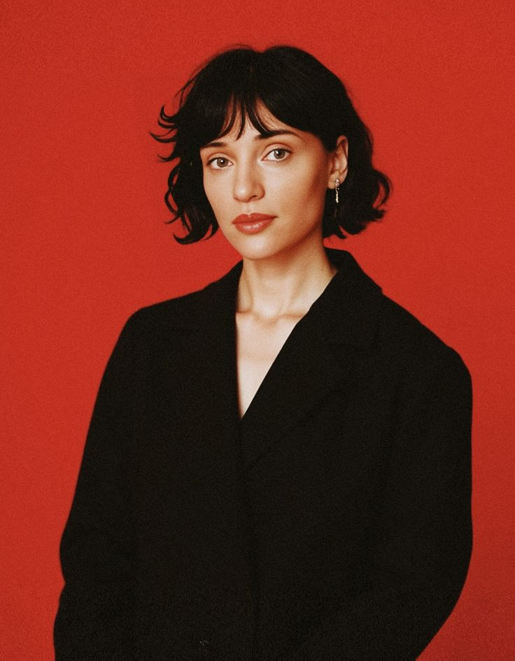
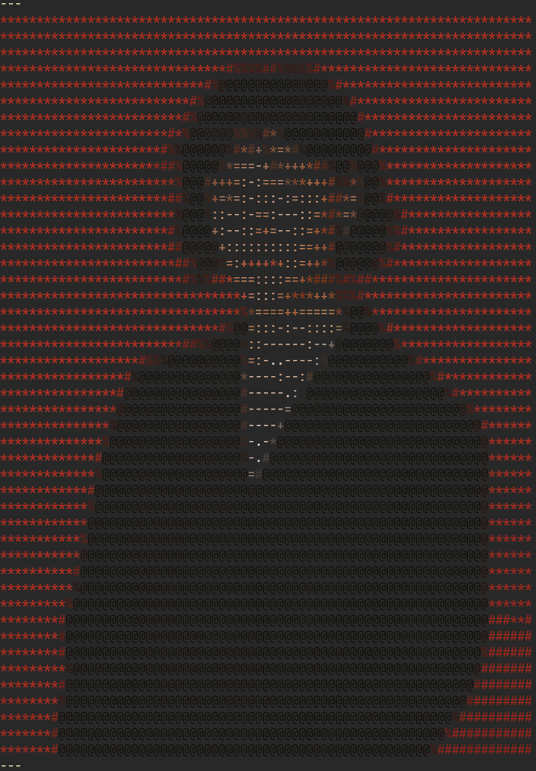

# ASCII Art Converter

A simple C program that converts images to ASCII art with optional color support.

## Example Output

### Original Image



### ASCII Art (Colored, scale: 10)



### ASCII ART (Plain Text, width: 50)

```
**************************************************
**************************************************
*********************#%%%%%%%%#*******************
*******************%@@@@@@@@@@@%#*****************
*****************#%@@@@@@@@@@@@@@%****************
***************##%@@@%##%*#@@@@@@@%***************
***************#%@@@@#+=:#++*#%@@%@%**************
****************#%@#+*=-:==*+=+##*@@#*************
****************#@@%=::-=:--::*#+#@@%#************
****************%@@@=:::==-::+*%%@@@%#************
****************#%%@%=:==+=:=+*%@@@@%#************
*****************#%%#*==:::=+**%###***************
***********************+:=+*++=*@%#***************
********************##@*:::::::=%@@%#*************
***************##%%@@@@=:-----=%@@@@@%#***********
************#@@@@@@@@@@:----:#@@@@@@@@@@%*********
***********%@@@@@@@@@@@:---:%@@@@@@@@@@@@@%#******
**********#@@@@@@@@@@@@:--=@@@@@@@@@@@@@@@@@%#****
*********#@@@@@@@@@@@@@:.+@@@@@@@@@@@@@@@@@@@%****
*********%@@@@@@@@@@@@@=*@@@@@@@@@@@@@@@@@@@@@****
********#@@@@@@@@@@@@@@@@@@@@@@@@@@@@@@@@@@@@%****
********%@@@@@@@@@@@@@@@@@@@@@@@@@@@@@@@@@@@@%****
********@@@@@@@@@@@@@@@@@@@@@@@@@@@@@@@@@@@@@%****
*******%@@@@@@@@@@@@@@@@@@@@@@@@@@@@@@@@@@@@@%****
*******@@@@@@@@@@@@@@@@@@@@@@@@@@@@@@@@@@@@@@%****
******%@@@@@@@@@@@@@@@@@@@@@@@@@@@@@@@@@@@@@@@*#**
*****#@@@@@@@@@@@@@@@@@@@@@@@@@@@@@@@@@@@@@@@@####
******@@@@@@@@@@@@@@@@@@@@@@@@@@@@@@@@@@@@@@@%####
******%@@@@@@@@@@@@@@@@@@@@@@@@@@@@@@@@@@@@@@#####
*****#@@@@@@@@@@@@@@@@@@@@@@@@@@@@@@@@@@@@@@######
*****%@@@@@@@@@@@@@@@@@@@@@@@@@@@@@@@@@@@@%#######
*****%@@@@@@@@@@@@@@@@@@@@@@@@@@@@@@@@@@@#########

```

## Features

- Load images in various formats (JPEG, PNG, BMP, GIF, etc.) using `stb_image`
- Convert images to ASCII art using brightness-based character mapping
- Optional 24-bit true color output using ANSI escape codes
- Auto-fits output to 50% of terminal width by default
- Manual width or scale override via CLI flags
- Save ASCII art to text files
- Proper aspect ratio handling for terminal display

## Project Structure

```
ascii_art/
├── include/                # Header files
│   ├── ascii.h             # ASCII conversion functions
│   └── image.h             # Image structure and loading
├── src/                    # Source files
│   ├── ascii.c             # ASCII conversion implementation
│   ├── image.c             # Image loading and processing
│   └── ascii_art.c         # Main program entry point
├── lib/                    # External libraries
│   └── stb_image.h         # Single-header image loading library
├── examples/               # Example images for testing
│   ├── test_1.jpg
│   ├── test_2.jpg
│   └── test_3.jpg
├── output/                 # Sample outputs
│   └── example_output_test_1.png
├── build/                  # Build artifacts (*.o files)
├── Makefile                # Build configuration
└── README.md               # This file
```

## Building

### Prerequisites

- GCC (or any C99-compatible compiler)
- Make
- A terminal that supports 24-bit color (optional, for color output)

### Compile

```bash
# Debug build (with debug symbols)
make

# Clean build artifacts
make clean
```

## Usage

### Basic Usage

```bash
# Display image auto-sized to 50% terminal width (colored)
./ascii_art examples/test_2.jpg

# Set exact output width in characters
./ascii_art examples/test_2.jpg --width 60

# Set downsampling factor
./ascii_art examples/test_2.jpg --scale 8

# Disable color output
./ascii_art examples/test_2.jpg --no-color

# Save to file (automatically disables color)
./ascii_art examples/test_2.jpg -o output/result.txt

# Show help
./ascii_art -h
```

### Command-Line Arguments

```
./ascii_art <image-file> [options]

Options:
  --width N       Set output width in characters
  --scale N       Set downsampling factor
  --no-color      Disable ANSI color codes
  -o <file>       Save ASCII art to file
  -h, --help      Show this help message

Priority: --width > --scale > auto-detect (50% terminal width)
```

## How It Works

### 1. Image Loading

- Uses `stb_image.h` to load various image formats
- Converts all images to RGB (3 channels)
- Stores pixel data in a simple `Image` structure

### 2. Downscaling

- Box-average downsampling to target dimensions via `image_downscale()`
- Target width determined by terminal size (50%), `--width`, or `--scale`
- Aspect ratio correction: height halved to account for terminal characters being ~2x taller than wide

### 3. Brightness Calculation

- Converts RGB to grayscale using the luminosity method:
  - `Gray = 0.299*R + 0.587*G + 0.114*B`
- This weights colors based on human eye sensitivity

### 4. ASCII Mapping

- Uses a 10-character palette ordered by visual density: `@%#*+=:-. `
- Dense characters (`@`, `%`, `#`) for darker areas
- Sparse characters (`.`, ` `) for brighter areas
- Maps grayscale values (0-255) to palette indices

### 5. Color Output (Optional)

- Uses ANSI 24-bit true color escape codes
- Format: `\033[38;2;R;G;Bm` for each character
- Preserves original image colors while using ASCII shapes

## ASCII Palette

The program uses this palette (10 characters, dark to light):

```
@%#*+=:-. 
```

Dense/complex characters appear darker, sparse characters appear lighter.

## License

This project is for educational purposes. The code itself is provided as-is.

stb_image.h is in the public domain (see file header for details).

## Acknowledgments

- Sean Barrett for stb_image
